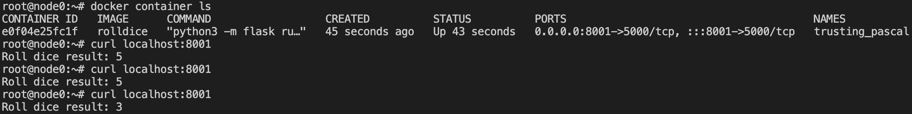
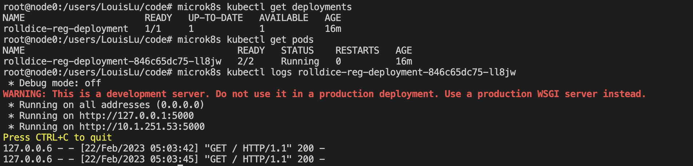
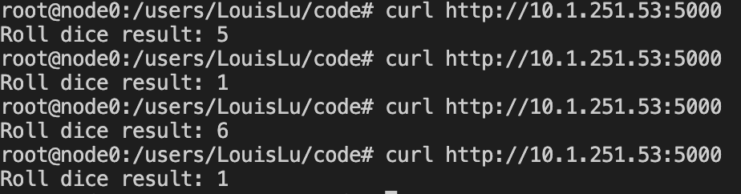

# Docker & K8S

## Docker

- Build docker image `rolldice`:

    ```shell
    docker build . -t rolldice
    ```

- Run docker image as a container:

    ```shell
    docker run -d -p 8001:5000 rolldice
    ```

- Container running on port 8001.

    

## MicroK8s

Deploy on MicroK8s using built-in registry. ([Link](https://microk8s.io/docs/registry-built-in))

- Enable registry

    ````shell
    microk8s enable registry
    ````

- Tag image with `localhost:32000/your-image` and then push

    ```shell
    docker build . -t localhost:32000/rolldice-reg:registry
    docker push localhost:32000/rolldice-reg:registry
    ```

- Deploy with MicroK8s

    ```shell
    microk8s kubectl apply -f rolldice-deployment.yaml
    ```

    Check deployments and pods

    ```shell
    microk8s kubectl get deployments
    microk8s kubectl get pods
    ```

    

- Successfully deployed

    
