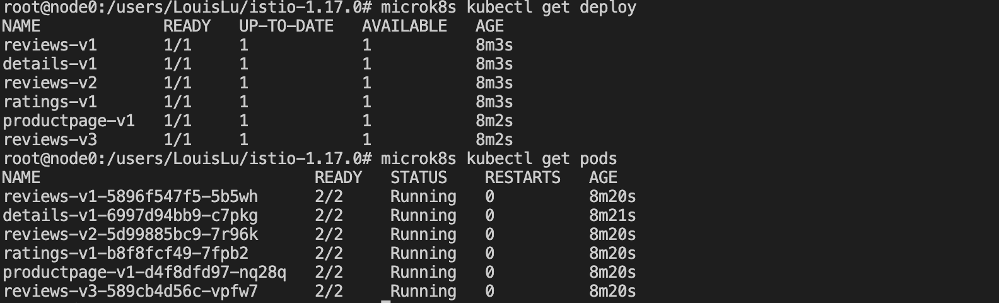
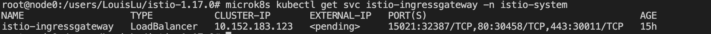
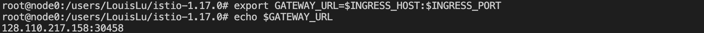
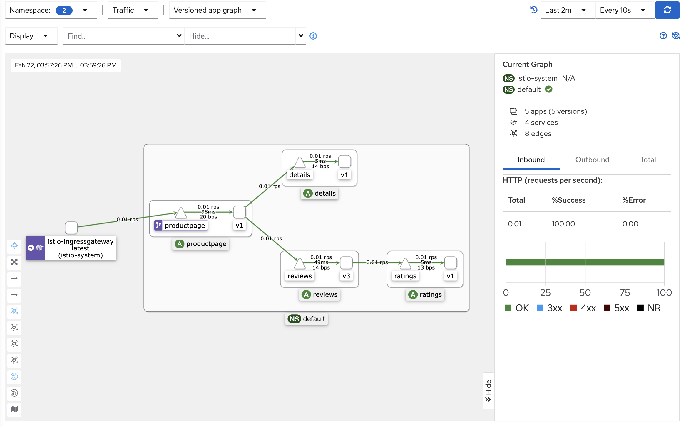
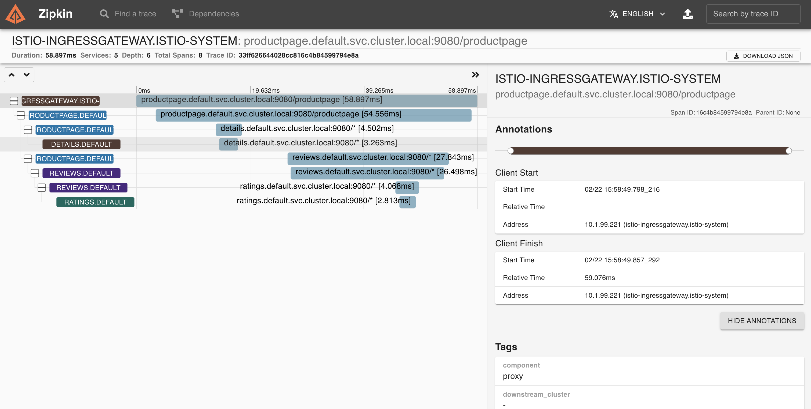

# Istio

## Getting Started

This part follows the istio tutorial [here](https://istio.io/latest/docs/setup/getting-started/).

- Deploy the `Bookinfo` sample application.

    

- Determine the ingress IP and ports.

    

    No external load balancer for the ingress gateway. We access the gateway using the service’s node port.
    The applocation can be accessed through the IP address and port.
    

## Distributed Tracing

- Kiali dashboard

    

- Zipkin

    

### Sampling rate

- Use the `meshConfig.defaultConfig.tracing.sampling` option during installation to set the sampling rate. The default sampling rate is 1%.

- Sampling rate can be set in the [`tracing.yaml`](tracing.yaml) file.

    We make changes to the sampling rate in configuration and then restart the pods to see the difference.
    Run `microk8s istioctl install -f tracing.yaml` to change configurations.

  - Sampling rate = 100%.
    

  - Sampling rate = 0.01%.
    
